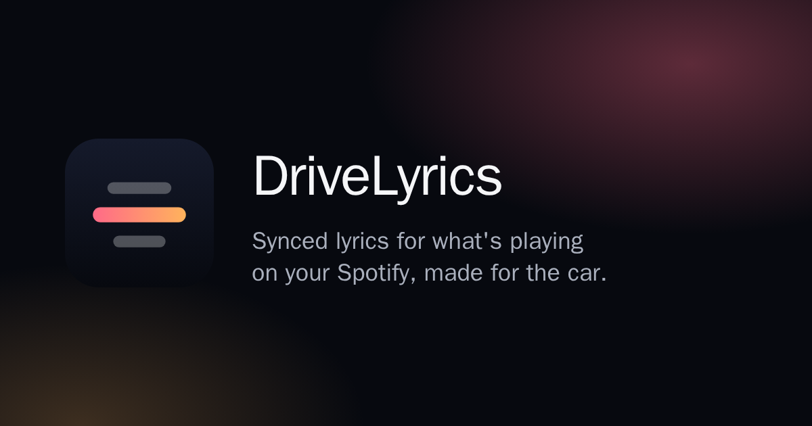

<p align="center"></p>

# DriveLyrics

Synced, line-by-line lyrics for whatever you're playing on Spotify — made for a car's
browser (Tesla), and fine on any tablet or desktop browser.

**Hosted version: [drivelyrics.com](https://drivelyrics.com)** — free; sign in with Google.
This repository is the same code, for reading and for running your own.

- **Synced line by line**, following Spotify's playback position (seeking and skipping
  included). Smooth on a car's weak GPU: one CSS transform per line change, no per-frame
  JavaScript.
- **Translations** under each line, when the lyrics source has them.
- **Accurate matching for Chinese songs**: title, artist and duration are scored together,
  Traditional and Simplified Chinese are folded together (OpenCC), and covers,
  instrumentals and live cuts are told apart.
- **Fix wrong lyrics in one tap**: pick the right version among every match; the fix is
  shared with everyone who plays that song.
- **Sign a car in by scanning a QR code** with a phone that's already signed in — nothing
  to type on the car screen. Sessions last until you sign out.
- **Multi-user**: Google sign-in; each user links their own Spotify developer app.
  Spotify secrets and tokens are encrypted at rest.
- English and Chinese UI.

## How it works

```
Spotify ──(each user's own app, OAuth)──▶ backend ──SSE──▶ browser (lyrics view)
                                            │
                    lyrics sources ◀────────┘   LRCLIB (built in)
                                                NetEase (optional, see below)
```

- **backend/** — FastAPI, SQLModel on SQLite. One poller per signed-in user, running only
  while one of their screens is open, polls Spotify's currently-playing endpoint and pushes
  snapshots over Server-Sent Events. Lyrics are matched once per Spotify track and source,
  cached, and shared by all users.
- **frontend/** — Vite + React + TypeScript, plain CSS. The landing page doubles as the car's
  sign-in screen (QR pairing).

## Requirements

- **Spotify Premium for every user.** Since February 2026 Spotify only runs
  development-mode apps for owners with an active Premium subscription, and each
  DriveLyrics user owns the app they link
  ([Spotify's migration guide](https://developer.spotify.com/documentation/web-api/tutorials/february-2026-migration-guide)).
- Docker with Compose, and a public **HTTPS** URL for the site (OAuth redirects need it).
- A Google OAuth client (type "Web application").

## Running your own

1. `cp backend/.env.example backend/.env` and fill it in:
   - `PUBLIC_BASE_URL` — e.g. `https://lyrics.example.com`
   - `ENCRYPTION_KEY` — generate once and keep it:
     `python -c "from cryptography.fernet import Fernet; print(Fernet.generate_key().decode())"`
   - `GOOGLE_CLIENT_ID`, `GOOGLE_CLIENT_SECRET` — authorized redirect URI:
     `<PUBLIC_BASE_URL>/api/auth/google/callback`
   - `OWNER_EMAIL` — your Google account's email; it becomes the admin (stats page at `/admin`).
2. `docker compose up -d --build` — the site listens on port 8080; put your HTTPS reverse
   proxy or tunnel in front of it.
3. Open the site, continue with Google, and follow the in-app steps to link Spotify (each
   user registers `<PUBLIC_BASE_URL>/api/spotify/callback` in their own Spotify app).

### Optional: NetEase Cloud Music as a second lyrics source

LRCLIB is built in and covers most English-language music. NetEase has the strongest
Chinese catalog and translated lyrics. DriveLyrics can use any service compatible with
the community NeteaseCloudMusicApi (`/search`, `/lyric`) that **you run yourself** — set
`NETEASE_API_BASE_URL` to it. No such service is included or endorsed here: the original
project was taken down after NetEase raised legal objections, so check whether running
one is appropriate where you are.

## Development

```sh
cd backend && poetry install && poetry run pytest -q
#   dev server: PUBLIC_BASE_URL=http://localhost:5173 DEV_LOGIN=true \
#               ENCRYPTION_KEY=... poetry run uvicorn app.main:app --reload
cd frontend && npm install && npm test && npm run dev   # proxies /api to :8000
```

`DEV_LOGIN=true` adds a sign-in-as-any-email form for local work. Never set it in production.

## License

[AGPL-3.0](LICENSE). You may run, modify and share it; if you offer a modified version
to others over a network, you must share its source under the same license.

Not affiliated with Spotify, Tesla, Google, NetEase or LRCLIB.
